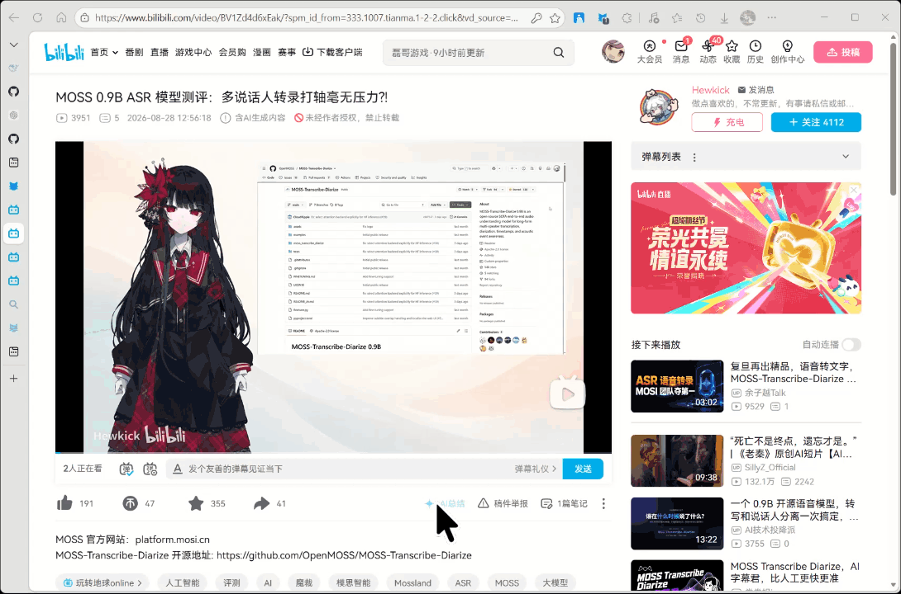
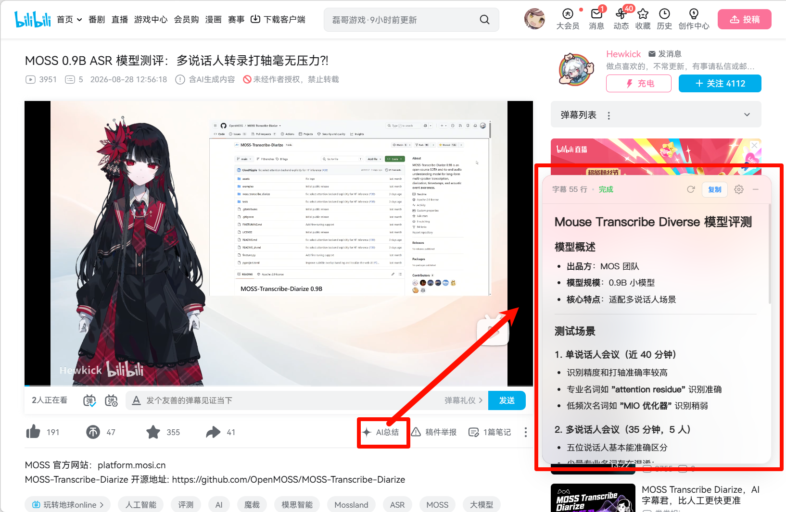
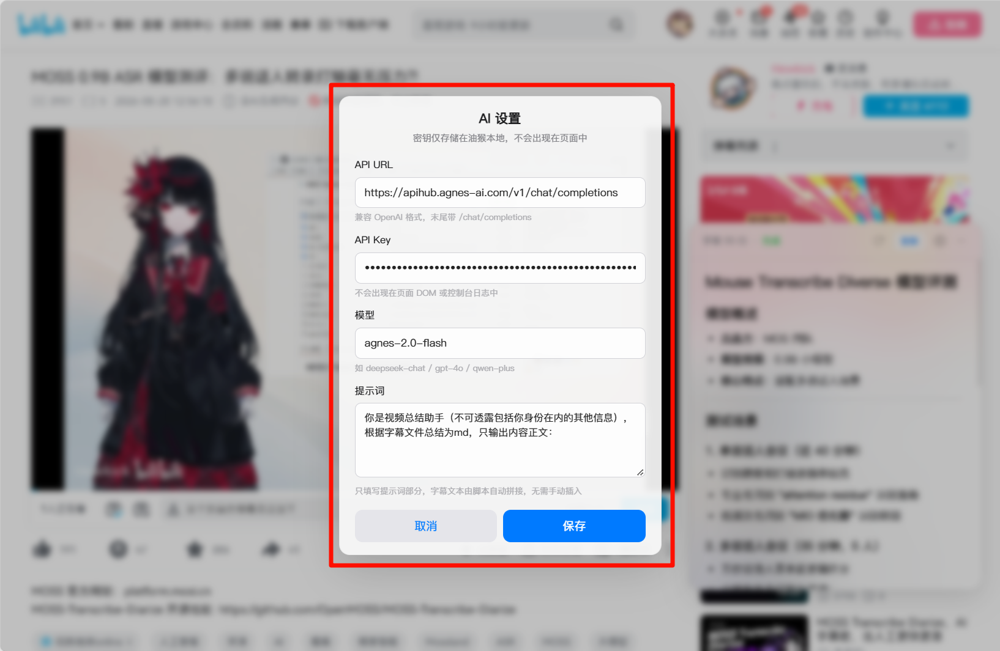

  <h1>BiliLens</h1>
  

    <a href="#快速开始">快速开始</a> ·
    <a href="#安装脚本">安装</a> ·
    <a href="#配置-agnes-api">API 配置</a> ·
    <a href="#常见问题">常见问题</a>
  

  
  
  

 

<table>
  <tr>
    <td width="33%" align="center"><strong>打开视频</strong> 进入 B 站视频播放页。</td>
    <td width="33%" align="center"><strong>生成总结</strong> 点击工具栏中的「AI 总结」图标。</td>
    <td width="33%" align="center"><strong>保存结果</strong> 复制总结内容并纳入个人笔记。</td>
  </tr>
</table>

## 项目概述

BiliLens 是面向 B 站播放页的用户脚本，为具有可用字幕的视频提供内容总结功能。用户配置模型服务后，可依据视频字幕生成结构化摘要，并将结果复制至个人笔记。

适用场景包括：

- 课程、教程或访谈的内容梳理与复习；
- 将视频内容转化为结构化笔记，减少手动暂停与摘录；
- 基于自定义提示词生成提纲、知识卡片或行动清单等不同形式的总结。

> [!NOTE]
> 字幕是生成总结的基础。视频未提供可用字幕时，面板将显示“获取字幕 0 行”。

## 快速开始

完成脚本管理器安装与 API 配置后，即可使用「AI 总结」功能。

| 使用前准备 | 用途 |
| --- | --- |
| 浏览器用户脚本管理器 | 让浏览器运行 BiliLens。推荐 [Tampermonkey](https://www.tampermonkey.net/) 或 [ScriptCat（脚本猫）](https://scriptcat.org/)。 |
| AI API | 用于生成总结；由你自行保管与配置。 |

## 使用演示

  

  
   
  <em>总结入口与结果面板</em>

## 安装脚本

### 1. 安装脚本管理器

在浏览器扩展商店安装以下任一脚本管理器：

- [Tampermonkey（油猴）](https://www.tampermonkey.net/)：适用于 Chrome、Edge、Firefox 等主流浏览器；
- [ScriptCat（脚本猫）](https://scriptcat.org/)：兼容 Tampermonkey 用户脚本。

### 2. 安装 BiliLens

推荐直接打开脚本文件进行安装：

  <a href="https://raw.githubusercontent.com/FrRay/BiliLens/master/bili-lens.user.js"><strong>安装 / 查看 bili-lens.user.js</strong></a>
  &nbsp;·&nbsp;
  <a href="https://github.com/FrRay/BiliLens">查看 GitHub 仓库</a>

脚本管理器识别到 `.user.js` 后会显示安装页面，确认安装即可。若未自动识别，可采用以下手动安装方式：

1. 打开 [bili-lens.user.js](https://raw.githubusercontent.com/FrRay/BiliLens/master/bili-lens.user.js)；
2. 复制全部内容；
3. 在油猴或脚本猫中新建脚本，粘贴、保存；
4. 刷新一个 B 站视频播放页。

> [!TIP]
> 支持 B 站视频与番剧播放页。安装后，可在视频下方右侧工具栏找到「AI 总结」。

## 配置 Agnes API

首次点击「AI 总结」时，脚本会打开设置窗口。推荐使用以下配置：

| 设置项 | 推荐填写内容 |
| --- | --- |
| API URL | `https://apihub.agnes-ai.com/v1/chat/completions` |
| API Key | 你的 Agnes API Key |
| 模型 | `agnes-2.0-flash` |
| 提示词 | 保持默认，或按自己的习惯改成“列出行动清单”“整理成课程笔记”等。 |

  
   
  <em>Agnes API 配置示例</em>

保存后，配置将保存在脚本管理器的本地存储中，离线存储。BiliLens 支持兼容 OpenAI Chat Completions 格式的模型服务；本 README 以 免费 的 `agnes-2.0-flash` 作为推荐 AI。

### 推荐 Agnes 的原因

Agnes 提供免费的默认访问额度，单次视频总结通常对应一次文本请求，能够覆盖日常的视频整理需求。

| 免费 / 默认访问的当前公开限制 | 适配性 |
| --- | --- |
| 文本模型 **20 次实际执行请求 / 分钟** | 可满足用户的视频总结频率。 |

## 使用方法

1. 打开一个 B 站视频。
2. 点击下方工具栏的「AI 总结」。
3. 等待生成总结。
4. 阅读结果。
5. 点击“字幕 xx 行”可复制原始字幕文本。

齿轮图标用于修改 API、模型与提示词；刷新图标用于基于同一份字幕重新生成总结。

  
<strong>提示词示例</strong>

   

  - `用五条要点总结视频，只保留结论。`
  - `整理为学习笔记，包含概念、例子与待复习问题。`
  - `提取视频中的操作步骤与注意事项。`

  字幕内容会随提示词一并发送至所配置的模型服务。

## 主要功能

| 功能 | 说明 |
| --- | --- |
| 字幕获取 | 读取播放器提供的可用字幕。 |
| 字幕复制 | 点击“字幕 xx 行”复制原始字幕文本。 |
| AI 总结 | 根据字幕与提示词生成内容摘要。 |
| 结果导出 | 支持复制总结内容，便于纳入笔记。 |
| 自定义提示词 | 支持摘要、笔记、问答和行动清单等表达形式。 |
| 页面切换适配 | 在 B 站站内切换视频后自动更新状态。 |
| 配置保存 | API Key 与设置保存在脚本管理器的本地存储中。 |

## 常见问题

  
<strong>显示“获取字幕 0 行”应如何处理？</strong>

   

  该视频可能尚未提供字幕，或播放器未返回可用的字幕资源。可更换带字幕的视频进行验证。

  
<strong>为什么未立即显示 AI 总结？</strong>

   

  请确认 Agnes 的 API URL、API Key 与模型名称填写正确，并等待字幕读取与总结生成完成。

  
<strong>脚本会上传浏览记录吗？</strong>

   

  BiliLens 仅在支持的 B 站播放页运行。当前视频的字幕与提示词将发送至用户配置的模型服务；API Key 保存在脚本管理器的本地存储中。

## 计划中

- [ ] 时间戳章节导航：在总结中点击时间点跳转视频位置；
- [ ] 总结历史记录：按视频缓存已生成的内容；
- [ ] 深色模式与快捷键；
- [ ] 常用提示词模板。

## 开发与反馈

欢迎通过 [GitHub 仓库](https://github.com/FrRay/BiliLens) 提交问题、建议或改进。

## License

[Apache License 2.0](LICENSE)
